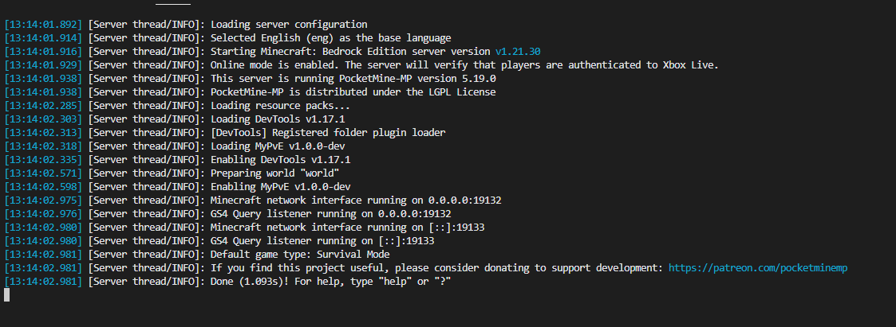

# MyPvE

### dockerで環境構築【推奨】
1. composerインストール（コード補完用）
```shell
docker run --rm --interactive --tty --volume .:/app composer install
```

2. .env.example をコピーしてポートなどを変更（任意）
```shell
cp .env.example .env
```

3. 開発サーバ起動  
    **Windows**
    ```ps
    ./dev-server.ps1
    ```
    **Mac/Linux**
    ```shell
    ./dev-server.sh
    ```
    **その他**
    ```shell
    docker compose run --rm --service-ports pmmp /usr/bin/start-pocketmine
    ```
### docker以外
普通に plugins/ に入れてもらえれば動くと思います。(Devtoolsなどは必要です)


